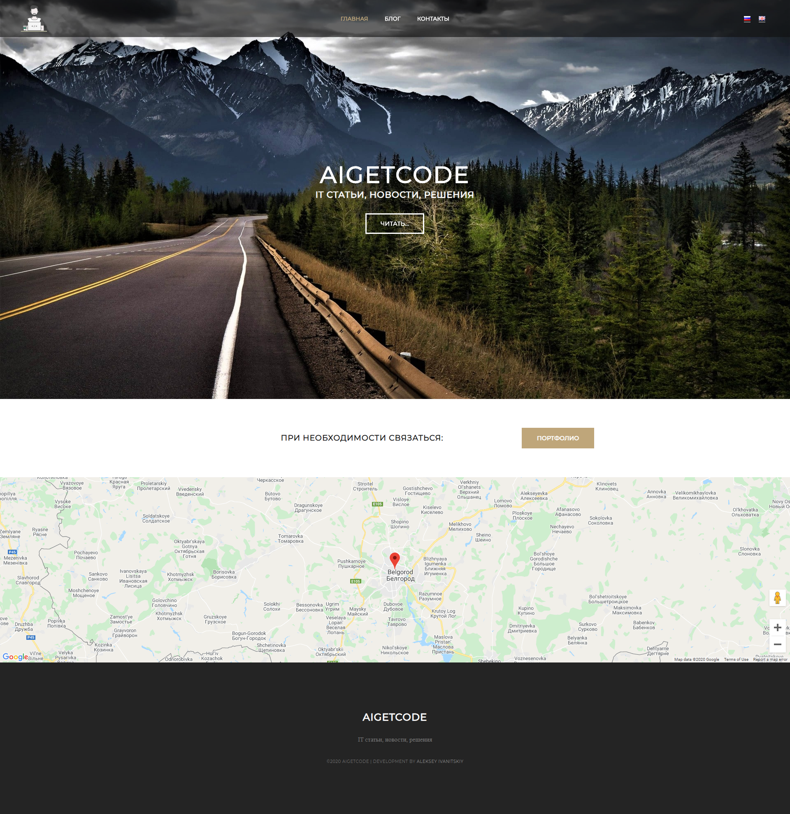
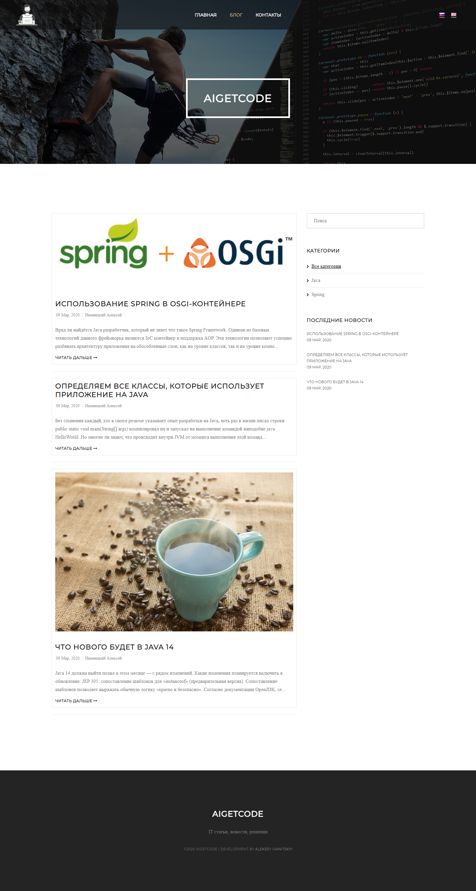
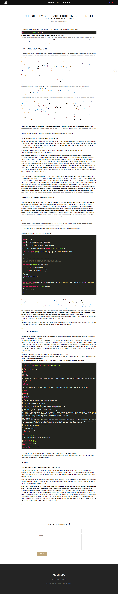
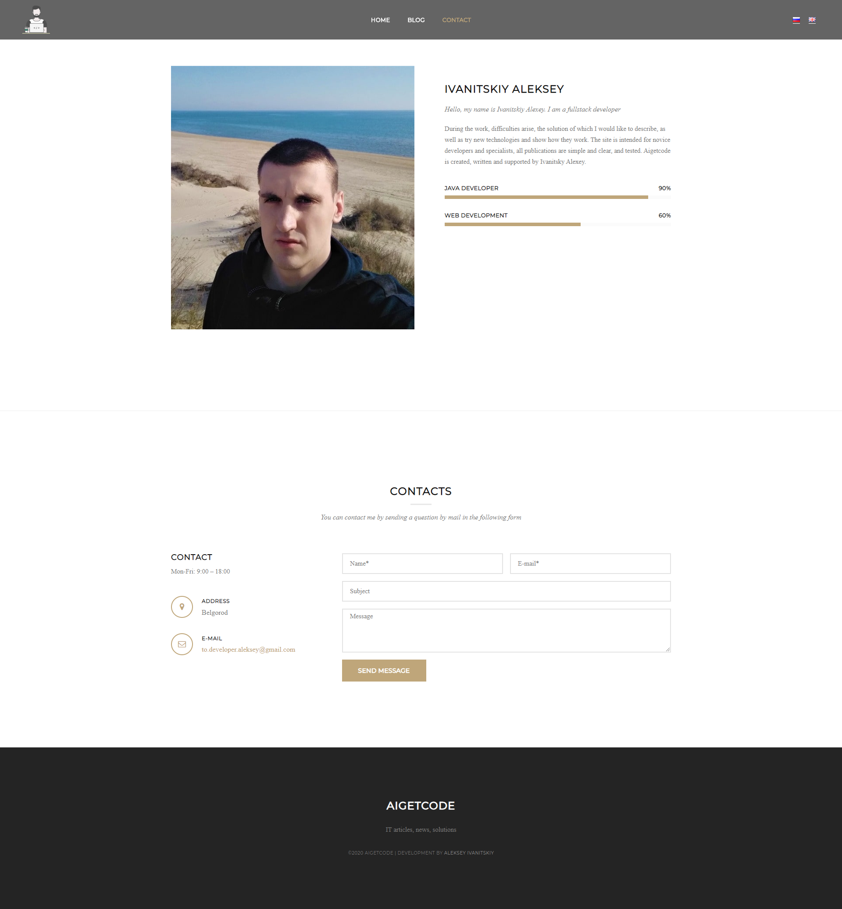
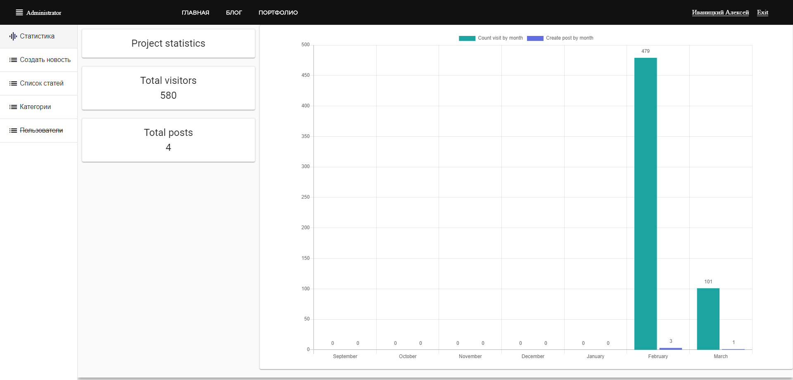

# Blog AIGetCode

Adaptive layout for any type of device
Spring Boot, Angular, PostgreSQL

## Requirements

1. Java - 1.8.x

2. Maven - 4.0.0

3. Spring Boot - 2.2.x

3. PostgreSQL

4. Angular - 8.2.x

## Steps to Setup

**1. Clone the application**

```bash
git clone repository_url
```

**2. Build and run the backend app using maven**

```bash
mvn package
java -jar target/app*.jar
```

Alternatively, you can run the app without packaging it using -

```bash
mvn spring-boot:run
```

The backend server will start at <http://localhost:8080>.

**3. Run the frontend app using npm**

```bash
npm install
npm start
```

Frontend server will run on <http://localhost:4200>

## Home page


## Blog page


## Post page 


## Contacts page


## Administration: statistic page 


